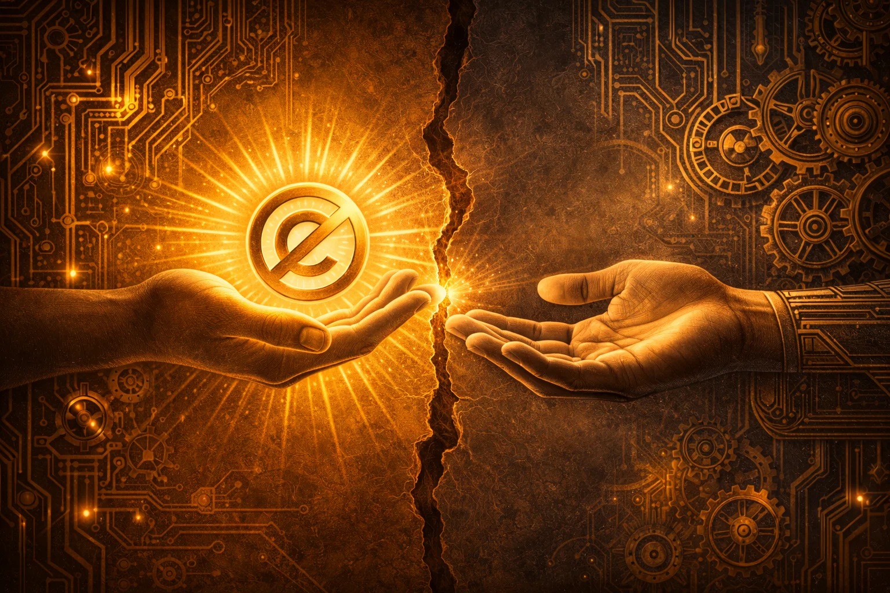

  
  

    <h1>Understanding Open Source</h1>
    
The foundations that everything else builds on

  

Before we get into the specifics of individual licenses, we need to establish some common ground. I've spent too many hours in meetings where everyone nodded along using the same words but meaning completely different things.

"Open source" isn't just a vibe. It has a definition—one that was argued over intensely in the late 1990s and has been tested in courts since. If you walk away from this section understanding nothing else, understand this: **open source is a legal framework, not a philosophy of sharing**.

## What Makes Software "Open Source"?

The OSI maintains the official definition.[^open-source-definition] Software is open source if its license guarantees:

1. **Free redistribution** — Anyone can share the software
2. **Source code availability** — The human-readable code must be obtainable
3. **Derived works permitted** — Others can modify and build upon it
4. **No discrimination** — The license can't restrict who uses it or for what purpose
5. **Technology neutrality** — The license can't mandate specific technology

Here's the part that trips people up: **simply making source code visible does not make software open source**. I can show you my code on GitHub right now, but if there's no license file, you have exactly zero legal rights to use it. Visibility is not permission.

## The Two Philosophies

Every open source license falls somewhere on a spectrum between two worldviews. I've watched people argue about this for thirty years, and I've come to believe both sides have valid points.

| Approach | Philosophy | Key Idea |
|----------|------------|----------|
| **Permissive** | Maximum freedom for users | "Do what you want, just give credit" |
| **Copyleft** | Preserve freedom for all | "Keep it open if you share it" |

The permissive camp says: "Freedom means no restrictions. Let people do what they want."

The copyleft camp says: "Freedom must be protected. Unrestricted freedom leads to restrictions."

They're both right, in their own way. Understanding this tension is the key to understanding everything else about open source licensing.

## In This Section

I've organized the fundamentals into four topics. Read them in order if you can—each builds on the last.

- [Free as in Freedom](libre-vs-gratis.md) — The "free speech vs free beer" distinction that confuses everyone
- [Permissive vs Copyleft](permissive-vs-copyleft.md) — The great philosophical divide
- [Rights & Obligations](rights-and-obligations.md) — What licenses give you and what they require in return
- [Common Misconceptions](common-misconceptions.md) — Myths I've heard repeated for decades

[^open-source-definition]: See [The Open Source Definition](../reference/sources.md#open-source-definition)
